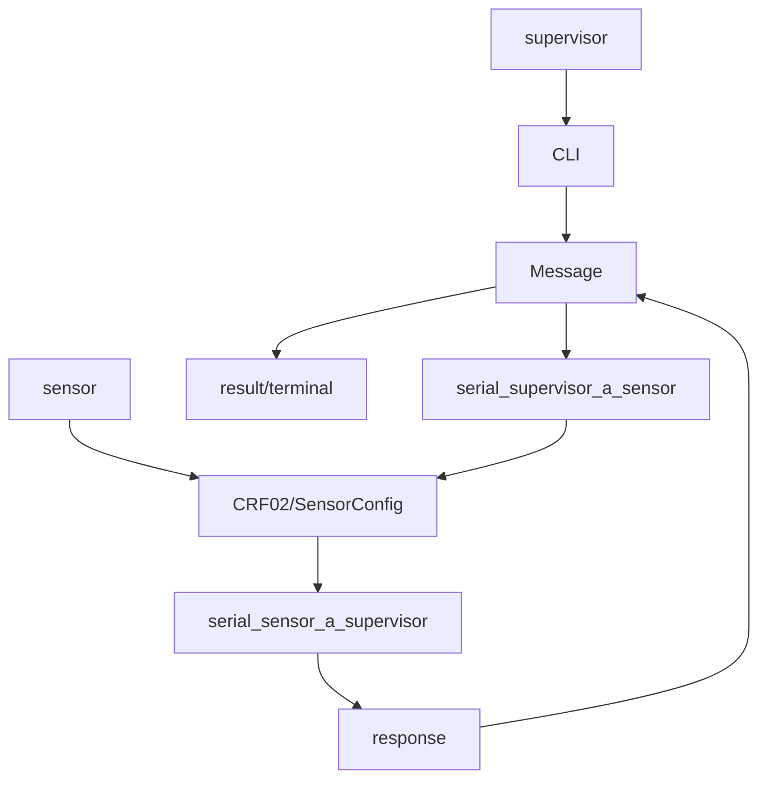

# estructura del proyecto
puesto que el compilador daba problemas con algunas funciones que devolvian struct o lo recibían, se propuso un enfoque modular:
+ comun
    + [message_protocol.h](/sensor/message_protocol.h)
    + [message_protocol.ino](/sensor/message_protocol.ino)
+ sensor
    + [rcf02.ino](/sensor/rcf02.ino)
    + [rcf02_i2c.h](/sensor/rcf02_i2c.h)
    + [sensor.h](/sensor/sensor.h)
    + [sensor.ino](/sensor/sensor.ino)
+ supervisor
    + [supervisor.h](/supervisor/supervisor.h)
    + [supervisor.ino](/supervisor/supervisor.ino)
    + [terminal.h](/supervisor/terminal.h)
    + [terminal.ino](/supervisor/terminal.ino)

# flujo



el supervisor usa terminal:CLI() en el loop() para leer todo el rato de la terminal con SerialUSB, codificando la orden en un Message{code,param}

```python
Message {
	code = byte( "command_id" in 0..9 << 4, "CRF02_dev" in 0xE0..0xFF -> "dev_id" in 0..0xF);
    uint16_t param;
}
```

con lo que segun la orden se enviara un Message al Sensor por Serial1, o se imprimira algo directamente como en "help", "us __ unit [inc,ms,cm]" habiendo hecho una modificacion en datos de las instancias de:
```cpp
typedef struct {
  bool cycle;
  uint16_t period;
  uint8_t addr;
  uint8_t unit;
  thread_t *thread;
} Sensor;
```
cuando se envia una orden a Sensor, este tiene un hilo (ChRt) que se encarga de leer Serial1, luego usa Mailbox para enviar el Message, compactado en uint32_t por simplicidad, al hilo correspondiente con el dispositivo direccionado por 
```cpp 
0xE0 + ((code & 0x0F) <<1)
```

dicho hilo lee el mensaje, ejecuta la orden y devuelve una respuesta por Serial1 como Message, manteniendo el mismo "code" en caso "success" y el resultado en "param".

de esa forma, el supervisor espera por la respuesta, comprueba que sea el mismo code, e imprime el resultado en terminal.

cuando el codigo no coincide, lo esperado es que sea un codigo de error 0xA_,0xB_,0xC_


# salida
## supervisor
```ruby
Supervisor iniciado.
## us 0xE0 status
[STATUS] Sensor 0xE0 | unit=cm | period=0 | delay=70 | cycle=OFF
## us 0xF2 status
[STATUS] Sensor 0xF2 | unit=cm | period=0 | delay=70 | cycle=OFF
## us 0xE0 one-shot
[ONE-SHOT] unit=5 # por defecto en cm=>unit=5
## response
[ONE-SHOT] 0xE0 → 0 cm
## us 0xE0 on 1000
[AUTO] 0xE0 → 0 cm
[AUTO] 0xE0 → 0 cm
[AUTO] 0xE0 → 0 cm
[AUTO] 0xE0 → 0 cm
[AUTO] 0xE0 → 0 cm
[AUTO] 0xE0 → 0 cm
[AUTO] 0xE0 → 0 cm
[AUTO] 0xE0 → 0 cm
[AUTO] 0xE0 → 0 cm
[AUTO] 0xE0 → 0 cm
[AUTO] 0xE0 → 0 cm
[AUTO] 0xE0 → 0 cm
## us 0xE0 unit ms
[INFO] Unidad cambiada para 0xE0 de cm a ms
[AUTO] 0xE0 → 0 ms
[AUTO] 0xE0 → 0 ms
[AUTO] 0xE0 → 0 ms
[AUTO] 0xE0 → 0 ms
[AUTO] 0xE0 → 0 ms
[AUTO] 0xE0 → 0 ms
## us 0xF2 status
[STATUS] Sensor 0xF2 | unit=cm | period=0 | delay=70 | cycle=OFF
[AUTO] 0xE0 → 0 ms
[AUTO] 0xE0 → 0 ms
[AUTO] 0xE0 → 0 ms
[AUTO] 0xE0 → 0 ms
## us 0xE0 status
[STATUS] Sensor 0xE0 | unit=ms | period=1000 | delay=70 | cycle=ON
[AUTO] 0xE0 → 0 ms
[AUTO] 0xE0 → 0 ms
[AUTO] 0xE0 → 0 ms
[AUTO] 0xE0 → 0 ms
[AUTO] 0xE0 → 0 ms
## us 0xE0 off
## us 0xE0 status
[STATUS] Sensor 0xE0 | unit=ms | period=0 | delay=70 | cycle=OFF
```

## sensor

```ruby
## us 0xE0 status
RECEIVED: 8:0:0
## us 0xF2 status
RECEIVED: 8:9:0
## us 0xE0 one-shot
RECEIVED: 1:0:5
executing shot on E0:70
waiting
high
expecting
readed
[ERROR] I2C read timeout addr=0x70 reg=0x2
low
expecting
readed
[ERROR] I2C read timeout addr=0x70 reg=0x3
one-shot: 70:0
sending reply: code=10 param=0
reply sent
RECEIVED: 8:0:0
## us 0xE0 on 1000 -> on-shot {
RECEIVED: 1:0:5
executing shot on E0:70
waiting
high
expecting
readed
[ERROR] I2C read timeout addr=0x70 reg=0x2 
low
expecting
readed
[ERROR] I2C read timeout addr=0x70 reg=0x3
one-shot: 70:0
sending reply: code=10 param=0
reply sent
## } en bucle
## tras cambiar unit => ms: {
RECEIVED: 1:0:6
executing shot on E0:70
waiting
high
expecting
readed
[ERROR] I2C read timeout addr=0x70 reg=0x2
low
expecting
readed
[ERROR] I2C read timeout addr=0x70 reg=0x3
one-shot: 70:0
sending reply: code=10 param=0
reply sent
## }

```
